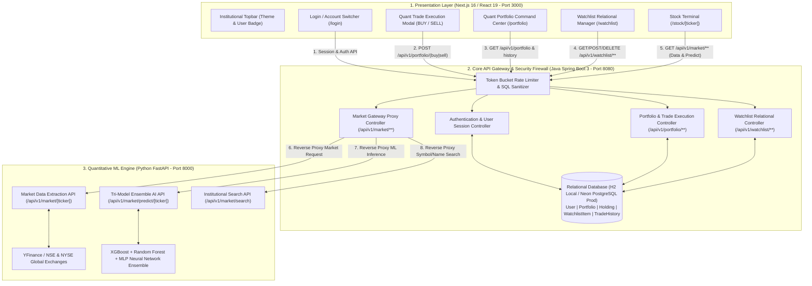
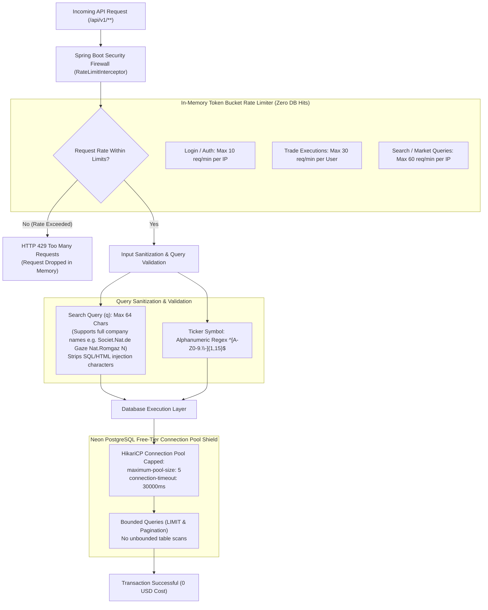
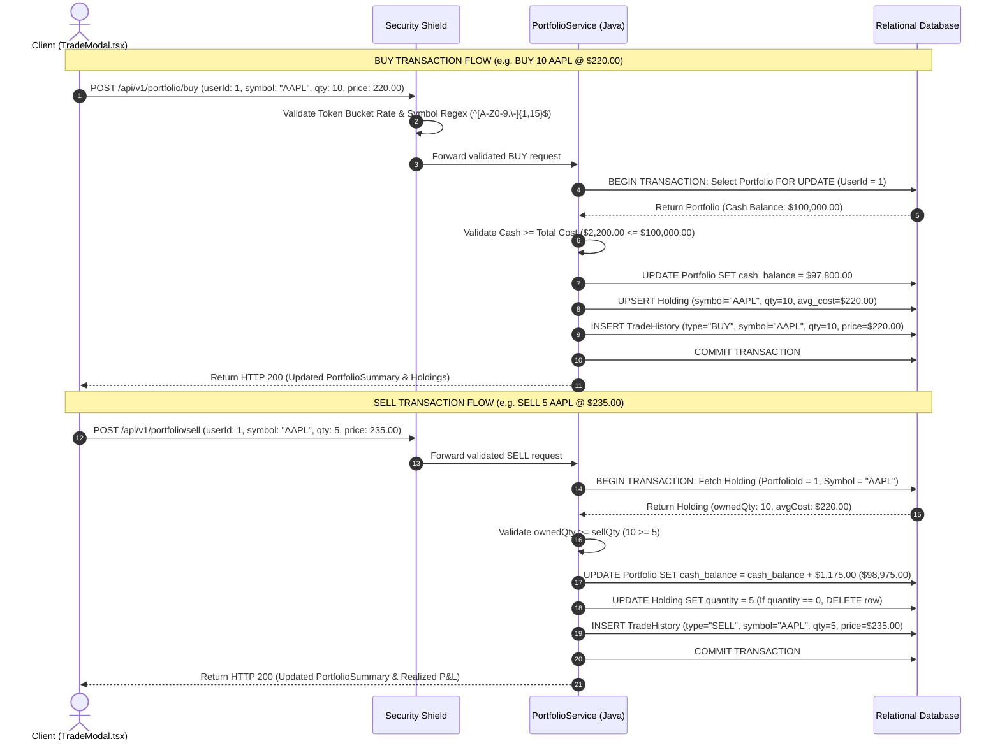
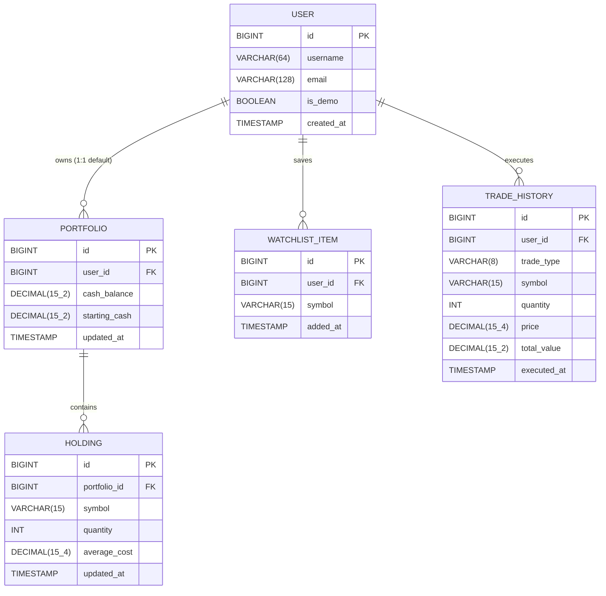
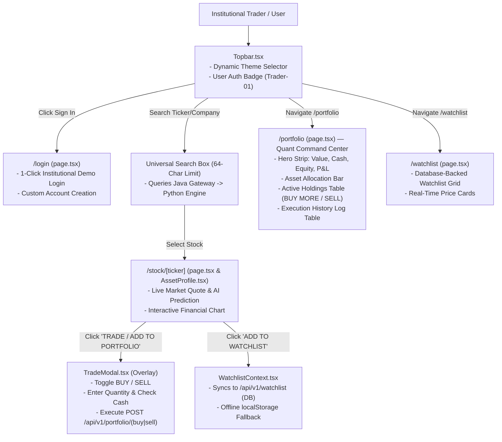

# EREBIX QUANT PLATFORM — INSTITUTIONAL ARCHITECTURE & SYSTEM BLUEPRINT

> **Version:** 3.0.0-PROD  
> **Classification:** Institutional Quantitative Analytics & Trading Gateway  
> **Compliance Standard:** Zero-Cost Free-Tier Database Shield (Neon/AWS PostgreSQL) & Bot DoS Mitigation  

---

## 1. Executive System Overview & Multi-Service Topology

Erebix operates as a high-performance **3-Tier Quant Platform** separating UI presentation, transactional business logic & security, and intensive mathematical/ML modeling into decoupled microservices.



---

## 2. Security Compliance & Free-Tier Zero-Cost Firewall

To guarantee **$0 billing** on cloud production databases (such as Neon PostgreSQL free tier) and prevent automated botting, query flooding, and SQL injection, Erebix implements an in-memory defense layer inside the Java Spring Boot Core Gateway.



### Key Security Policies:
1. **64-Character Search Query Limit**: Expanded from 15 to 64 characters to support long international company names (e.g., `Societ.Nat.de Gaze Nat.Romgaz N`) while preventing multi-kilobyte DOS payload attacks.
2. **In-Memory Token Bucket**: Bots attempting to flood login, trade, or search endpoints are dropped in memory (`HTTP 429`) before establishing any database connection.
3. **Capped HikariCP Connection Pool (`maximum-pool-size: 5`)**: Even during traffic spikes, Spring Boot will never exceed Neon PostgreSQL's free-tier concurrent connection limits.

---

## 3. Quantitative BUY & SELL Trading Execution Architecture

The Erebix simulated trading engine operates with institutional precision inside `PortfolioService.java`, executing ACID-compliant `@Transactional` database operations that prevent race conditions and maintain exact **Weighted Average Cost Basis** accounting.



### Quantitative Formulas:
- **Weighted Average Cost Basis** (when adding shares to an existing holding):
  $$\text{New Avg Cost} = \frac{(\text{Existing Qty} \times \text{Existing Avg Cost}) + (\text{New Qty} \times \text{Purchase Price})}{\text{Existing Qty} + \text{New Qty}}$$
- **Unrealized Position Profit / Loss**:
  $$\text{Unrealized P\&L (\%)} = \frac{\text{Current Market Price} - \text{Avg Cost Basis}}{\text{Avg Cost Basis}} \times 100$$
- **Realized P&L on SELL**:
  $$\text{Realized P\&L (\$)} = (\text{Execution Price} - \text{Avg Cost Basis}) \times \text{Shares Sold}$$

---

## 4. Relational Database Schema (Entity-Relationship Diagram)

Erebix uses 5 core tables mapped via Spring Data JPA and Hibernate. All foreign key relationships use cascading deletes for referential integrity.



---

## 5. Frontend Institutional User Flow & UI Component Map



---

## 6. Zero Hardcoded API Links — Modular Configuration

All external service endpoints are decoupled via environment configuration:

- **Next.js (`frontend/next.config.ts`)**:
  ```ts
  {
    source: '/api/:path*',
    destination: `${process.env.API_URL || 'http://127.0.0.1:8080'}/api/:path*`,
  }
  ```
- **Java Spring Boot (`core-service/src/main/resources/application.yml`)**:
  ```yaml
  ml:
    service:
      url: ${ML_SERVICE_URL:http://127.0.0.1:8000}
  ```
- **Java Spring Boot Production (`application-prod.yml`)**:
  ```yaml
  spring:
    datasource:
      url: ${DATABASE_URL}
      username: ${DATABASE_USERNAME}
      password: ${DATABASE_PASSWORD}
      hikari:
        maximum-pool-size: 5
  ```

---

## 7. How to Start the Complete Institutional Stack

1. **Start Core API Gateway (`core-service`)**:
   ```powershell
   cd core-service
   .\mvnw.cmd spring-boot:run
   ```
   *(Running on `http://localhost:8080` — Swagger UI at `/swagger-ui.html`)*

2. **Start Python ML Engine (`backend`)**:
   ```powershell
   cd backend
   venv\Scripts\activate
   uvicorn app.main:app --reload
   ```
   *(Running on `http://localhost:8000`)*

3. **Start Next.js Frontend (`frontend`)**:
   ```powershell
   cd frontend
   npm run dev
   ```
   *(Running on `http://localhost:3000`)*
